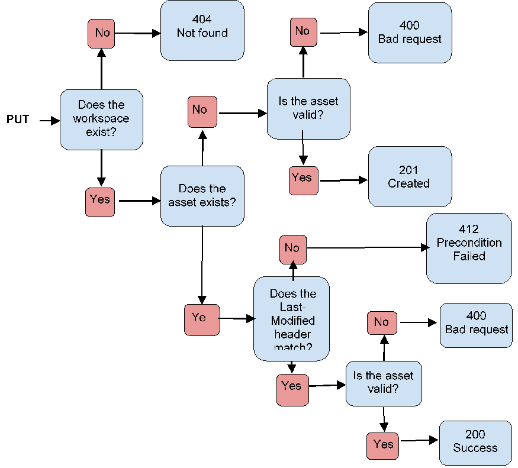
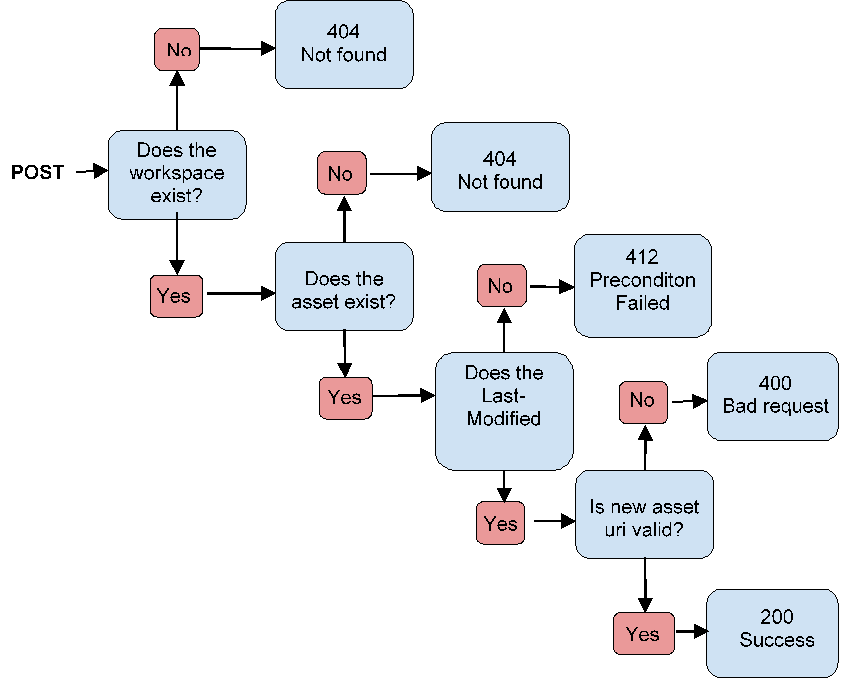
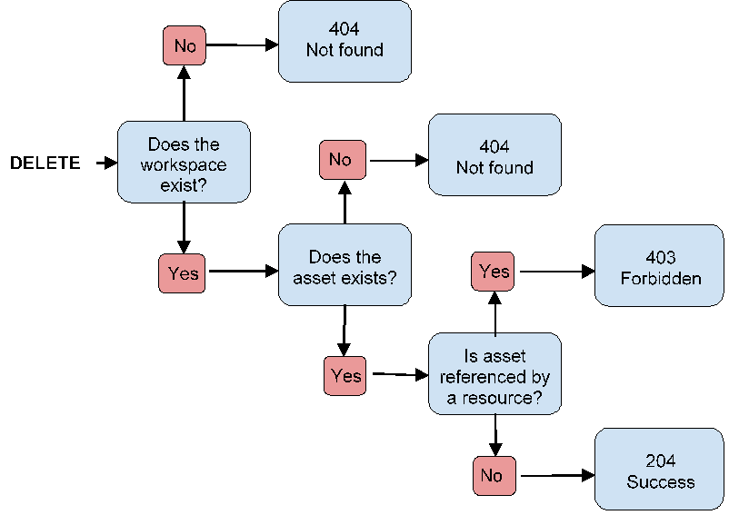

**[Home](Home)**

This HTTP interface deals with methods for managing assets. Browsing functionalities are implemented by a different [one]()

Specifications:

- [Asset]()
- [REST API]()

**NOTE: Only assets version 1.1.0 are supported by this API**

### GET | Retrieve api description

**/assetmanager**

The api description is accessible from the above base url. The representation is organized like this:
```javascript
{
    name: "Asset manager",
    version: "0.1.0",
    workspaces_url: "/workspaces/"
}
```

Response:

| Code | Mimetype | Data type | Data |
|------|--------|--------|----------------------|
| 200 | application/json | Object | { api description } |


### POST | Create a workspace

Create a workspace by cloning a project.

**/assetmanager/workspaces**

Request:
<table>
  <tr>
    <td>Headers</td>
  </tr>
  <tr>
    <td>Content-Type</td>
    <td>This is a json so the content type is "application/json"</td>
  </tr>
</table>

<table>
  <tr>
    <td>Body</td>
  </tr>
  <tr>
    <td>Workspace meta information</td>
    <td>{ file_uri: workspace file uri in client fs, name: workspace name, organization: organization name, project_name: project name, branch: OPTIONAL - specific branch to checkout from project (master if not specified), description: OPTIONAL - description of the created workspace }
    </td>
  </tr>
</table>

<table>
  <tr>
    <td>Path</td>
  </tr>
  <tr>
    <td>/workspaces</td>
    <td>Path that routes to workspaces services</td>
  </tr>
</table>

Response:

| Code | Mimetype | Data type | Data |
|------|--------|--------|----------------------|
| 200 | application/json | String | { workspace metadata } |

### DELETE | Delete a workspace

Delete workspace in client file system.

**/assetmanager/workspaces/{workspace_guid||workspace_name}**

Request:
<table>
  <tr>
    <td>Headers</td>
  </tr>
  <tr>
    <td>Content-Type</td>
    <td>This is a json so the content type is "application/json"</td>
  </tr>
</table>

<table>
  <tr>
    <td>Path</td>
  </tr>
  <tr>
    <td>/workspaces/</td>
    <td>Is a fixed string that routes to workspace module</td>
  </tr>
  <tr>
    <td>{workspace_guid}</td>
    <td>This is the workspace guid generated by the server once the workspace get cloned.  It must match "/^[a-zA-Z0-9]{40}$/" regular expression. Example: "8169e370774a07af0898f771e0a5b5391ca792a8"</td>
  </tr>
  <tr>
    <td>{workspace_name}</td>
    <td>Workspace name can be used instead of the ids.  Example: "feat/test/new", "hello-world". It can be capitalized, but it is not allowed to have two workspace names that only differentiate in their capitalization. It must match "/^[[\w\/\.-]{0,100}$/" regular expression.</td>
  </tr>
</table>

Response:

| Code | Mimetype | Data type | Data |
|------|--------|--------|----------------------|
| 200 | application/json | String | "Ok" |
***

### POST | Add a workspace to favorite list

Add workspace reference in the favorite list cf([/contentbrowser/workspaces]()] indexed by our [setting file]().

**/assetmanager/workspaces/favorites**

Request:
<table>
  <tr>
    <td>Headers</td>
  </tr>
  <tr>
    <td>Content-Type</td>
    <td>This is a json so the content type is "application/json"</td>
  </tr>
</table>

<table>
  <tr>
    <td>Body</td>
  </tr>
  <tr>
    <td>Workspace meta information</td>
    <td>{ file_uri: workspace file uri in client fs }</td>
  </tr>
</table>

<table>
  <tr>
    <td>Path</td>
  </tr>
  <tr>
    <td>/workspaces</td>
    <td>Path that routes to workspaces services</td>
  </tr>
</table>

Response:

| Code | Mimetype | Data type | Data |
|------|--------|--------|----------------------|
| 200 | application/json | String | { workspace metadata } |

Example answer:

```
{ 
    name: 'feat/test-workspace', 
    guid: 'e39d0f72c81c445ba801dsssssss45219sddsdss', 
    description: 'This is your first workspace cloned from DLC_1 branch !', 
    type: 'application/vnd.bilrost.workspace+json' 
} 
```

### DELETE | Forget a workspace from favorite list

Forget a project from the [setting file]() where are stored favorite workspaces.

**/assetmanager/workspaces/{workspace_guid||workspace_name}/favorites**

Request:
<table>
  <tr>
    <td>Headers</td>
  </tr>
  <tr>
    <td>Content-Type</td>
    <td>This is a json so the content type is "application/json"</td>
  </tr>
</table>

<table>
  <tr>
    <td>Path</td>
  </tr>
  <tr>
    <td>/workspaces/</td>
    <td>Is a fixed string that routes to workspace module</td>
  </tr>
  <tr>
    <td>{workspace_guid}</td>
    <td>This is the workspace guid generated by the server once the workspace get cloned.  It must match "/^[a-zA-Z0-9]{40}$/" regular expression. Example: "8169e370774a07af0898f771e0a5b5391ca792a8"</td>
  </tr>
  <tr>
    <td>{workspace_name}</td>
    <td>Workspace name can be used instead of the ids.  Example: "feat/test/new", "hello-world". It can be capitalized, but it is not allowed to have two workspace names that only differentiate in their capitalization. It must match "/^[[\w\/\.-]{0,100}$/" regular expression.</td>
  </tr>
</table>

Response:

| Code | Mimetype | Data type | Data |
|------|--------|--------|----------------------|
| 200 | application/json | String | "Ok" |

***

### GET | Retrieve Workspace Status

**/assetmanager/workspaces/{workspace_guid||workspace_name}/status**

A Workspace has statuses for multiple specific contexts. The result of this request is VALID if, and only if, all the contexts' statuses are not "INVALID".

Response:

| Code | Mimetype | Data type | Data |
|------|--------|--------|----------------------|
| 200 | application/json | Object | { state : "status_name", context : "context_name", info : {guilty_status: {Status}, guilty_ref: "context_name"} } |

### GET | Retrieve Workspace Status List

**/assetmanager/workspaces/{workspace_guid||workspace_name}/statuses**

A Workspace has statuses for multiple specific contexts. The result of this request is a list relating each context to it's respective status.

Response:

| Code | Mimetype | Data type | Data |
|------|--------|--------|----------------------|
| 200 | application/json | Object | [{ state : "status_name", context : "context_name", info : {...} }, ...] |

### PUT | Create and update an asset

**/assetmanager/workspaces/{workspace_guid||workspace_name}{asset_ref}**



Request:
<table>
  <tr>
    <td>Headers</td>
  </tr>
  <tr>
    <td>Content-Type*</td>
    <td>The asset type. eg application/json</td>
  </tr>
  <tr>
    <td>Last-modified</td>
    <td>The date under ISO format when the asset has been latest modified. eg 2016-08-16T07:29:11.695Z</td>
  </tr>
</table>

<table>
  <tr>
    <td>Body</td>
  </tr>
  <tr>
    <td>Asset resource without meta information</td>
    <td>{
    tags: Array of Strings,
    comment: String,
    main: String,
    dependencies: Array of String,
    semantics: Array of String or Object
}</td>
  </tr>
</table>

<table>
  <tr>
    <td>Path</td>
  </tr>
  <tr>
    <td>/workspaces/</td>
    <td>Is a fixed string that routes to workspaces module</td>
  </tr>
  <tr>
    <td>{workspace_guid}</td>
    <td>This is the workspace guid generated by the server once the workspace get cloned. It must match "/^[a-zA-Z0-9]{40}$/" regular expression. Example: "8169e370774a07af0898f771e0a5b5391ca792a8"</td>
  </tr>
  <tr>
    <td>{asset_ref}</td>
    <td> It must start with "assets/" keyword. Example: "assets/test/example.level", "assets/test/" and "assets/". Asset refs can be capitalized, but it is not allowed to have two asset refs that only differentiate in their capitalization. it must match "/^(assets|resources)\/.*/" regular expression.</td>
  </tr>
</table>

Response:

| Code | Mime-type | Data type | Data |
|------|--------|--------|----------------------|
| 200 | application/json | Object | { asset metadata } |
| 201 | application/json | Object | { asset metadata } |

##### Examples

* /assetmanager/workspaces/example/assets/new_asset
returns 201 as it creates the new asset
* /assetmanager/workspaces/example/assets/new_asset
returns 200 as it updates the new asset previously created

### POST | Rename an asset

**/assetmanager/workspaces/{workspace_guid||workspace_name}/rename{asset_ref}**



Request:
<table>
  <tr>
    <td>Headers</td>
  </tr>
  <tr>
    <td>Content-Type</td>
    <td>The asset type. eg application/json</td>
  </tr>
  <tr>
    <td>Last-modified</td>
    <td>The date under ISO format when the asset has been latest modified. eg 2016-08-16T07:29:11.695Z</td>
  </tr>
</table>

<table>
  <tr>
    <td>Body</td>
  </tr>
  <tr>
    <td>New asset reference</td>
    <td>{
    new: assets/new_ref
}</td>
  </tr>
</table>

<table>
  <tr>
    <td>Path</td>
  </tr>
  <tr>
    <td>/workspaces/</td>
    <td>Is a fixed string that routes to workspaces module</td>
  </tr>
  <tr>
    <td>{workspace_guid}</td>
    <td>This is the workspace guid generated by the server once the workspace get cloned. It must match "/^[a-zA-Z0-9]{40}$/" regular expression. Example: "8169e370774a07af0898f771e0a5b5391ca792a8"</td>
  </tr>
  <tr>
    <td>/rename/</td>
    <td>Is a fixed string that informs the action to perform. In this case the route is asking for renaming</td>
  </tr>
  <tr>
    <td>{asset_ref}</td>
    <td> It must start with "assets/" keyword. Example: "assets/test/example.level", "assets/test/" and "assets/". Asset refs can be capitalized, but it is not allowed to have two asset refs that only differentiate in their capitalization. it must match "/^(assets|resources)\/.*/" regular expression.</td>
  </tr>
</table>

Response:

| Code | Mime-type | Data type | Data |
|------|--------|--------|----------------------|
| 200 | application/json | Object | { asset metadata } |

##### Examples

* /assetmanager/workspaces/example/assets/new_asset
returns 200 as it renames the asset with the ref informed in the body message

### DELETE | Delete an asset

**/assetmanager/workspaces/{workspace_guid||workspace_name}{asset_ref}**



Request:
<table>
  <tr>
    <td>Path</td>
  </tr>
  <tr>
    <td>/workspaces/</td>
    <td>Is a fixed string that routes to workspaces module</td>
  </tr>
  <tr>
    <td>{workspace_guid}</td>
    <td>This is the workspace guid generated by the server once the workspace get cloned. It must match "/^[a-zA-Z0-9]{40}$/" regular expression. Example: "8169e370774a07af0898f771e0a5b5391ca792a8"</td>
  </tr>
  <tr>
    <td>{asset_ref}</td>
    <td> It must start with "assets/" keyword. Example: "assets/test/example.level", "assets/test/" and "assets/". Asset refs can be capitalized, but it is not allowed to have two asset refs that only differentiate in their capitalization. it must match "/^(assets|resources)\/.*/" regular expression.</td>
  </tr>
</table>

Response:

| Code | Mime-type | Data type | Data |
|------|--------|--------|----------------------|
| 204 | application/json | Object | No content |

### ERROR PROTOCOL

| Code | Mimetype | Data type | Message | Example |
|------|--------|--------|----------------------|----------------------|
| 403 | application/json | Error | [object] already exist | [PUT] /contentbrowser/workspaces an already existing worskpace in favorite list. |
| 404 | application/json | Error | [api name] not found, [element_not_found] | [GET] /contentbrowser/workspaces/ an unknown workspace. |
| 400 | application/json | Error | [api name] corrupted, [element_not_valid] cannot be found or is invalid | [GET] /contentbrowser/workspaces/{workspace_identifier} where workspace_identifier points to an invalid workspace resource. | 
| 500 | application/json | Error | [api name] programms encoutered an unexpected failure: [error] | [GET] /contentbrowser/workspaces/{workspace_identifier} and the server couldn't read the workspace content as the server doesn't have read access. The error paramater will output then the related internal error from the server. | 
| 501 | application/json | Error | [api name] not found, [element_not_supported] is not supported yet' | [GET] /contentbrowser/projects informs that this route isn't fully implemented yet. |
| | | | |  |


#### All other trademarks are the property of their respective owners
#### Copyright (C) 2015-2018 Starbreeze AB All Rights Reserved
